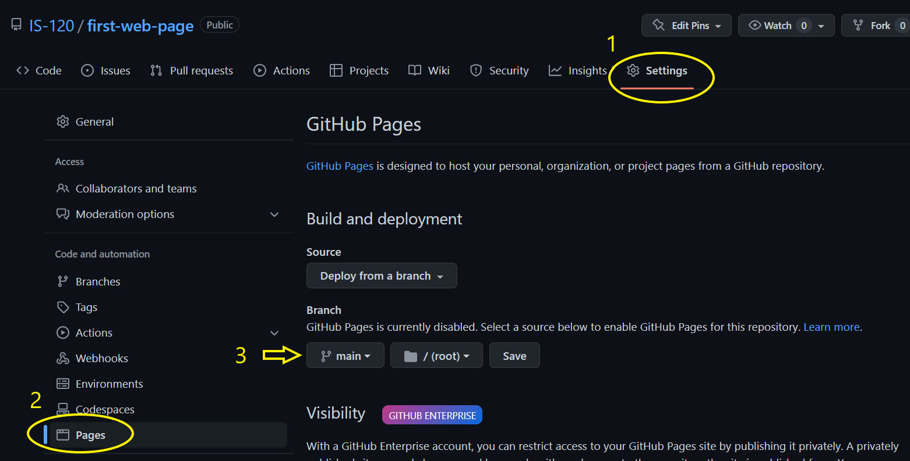
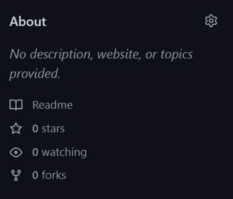
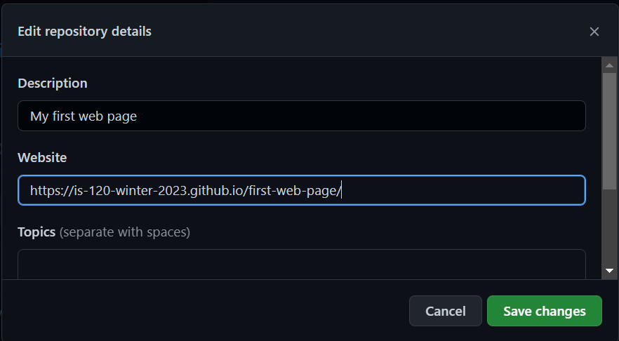
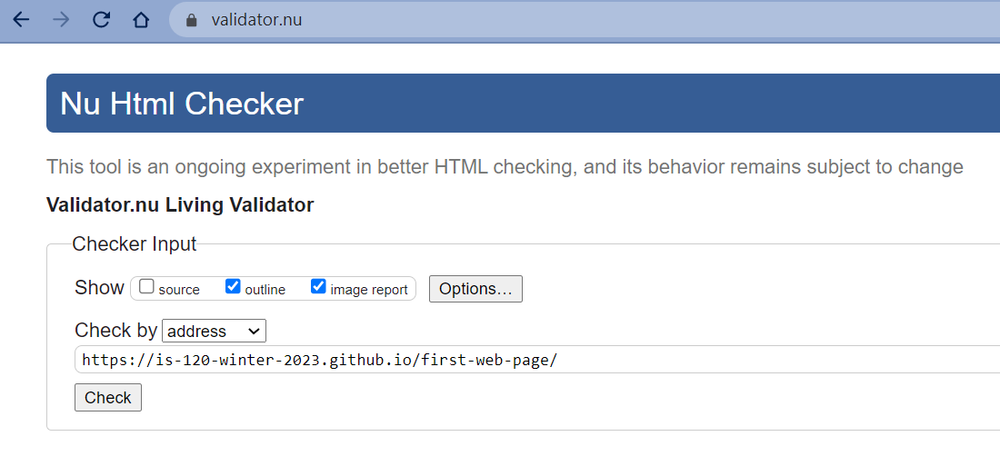
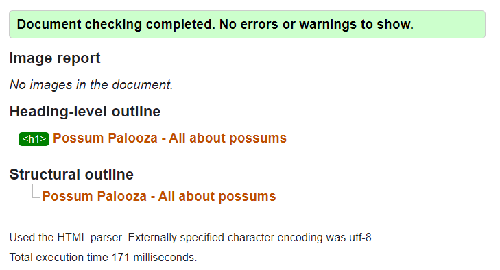

# First web page assignment

## Objectives

Host a basic `index.html` file on Github Pages. Include a favicon and make sure that the page validates with no errors or warnings.

**Prerequisites**:

- VS Code installed and configured.
- Git installed and configured. For help with installing and configuring Git, view my [Installing Git for IS 120](https://youtu.be/zshf_32xbsI) video.
- This Github Classroom assignment accepted and a repo of it created on your IS 120 organization Github account.

| ⚠️ Extra files                                                                                                                                                                          |
| :-------------------------------------------------------------------------------------------------------------------------------------------------------------------------------------- |
| The assignment repos in this course have extra files and folders (two `.json` files and `test`,`readme-assets`, and `.github` folders) for automated testing. Don't delete these files. |

## 📝Clone this assignment repo to VS Code

| 💡 Organization                                                                                                                     |
| :---------------------------------------------------------------------------------------------------------------------------------- |
| I recommend creating a folder on your computer specifically for this class and choosing it to clone all your assignment repos into. |

At the top right of your Github repo, find and click the Code button and copy the URL in the HTTPS field (see image below)


Open VS Code, and choose "Clone Git repository" on the welcome screen or in the command palette, `View -> Command Palette...`. Paste the URL, select a folder on your computer to copy the containing repo folder and its files, and when prompted, open the local copy of the repo in VS Code.

## :page_facing_up: Create and personalize your index.html file

Open the Explorer sidebar. Either click on the Explorer icon in the VS Code Activity Bar (vertical menu with icons) or use the keyboard shortcut `Ctrl-B` on a PC or `⌘B` on a Mac. Next, open the `index.html` file.

The file should be empty. Use Emmet to generate a the basic structure of an HTML file: type an exclamation point `!` and press `Tab`. You should see the following markup appear in the file:

```html
<!DOCTYPE html>
<html lang="en">
  <head>
    <meta charset="UTF-8" />
    <meta http-equiv="X-UA-Compatible" content="IE=edge" />
    <meta name="viewport" content="width=device-width, initial-scale=1.0" />
    <title>Document</title>
  </head>
  <body></body>
</html>
```

### Configuring `<head>`

Elements in the `<head>` section of an HTML file are not visible on the page. They are used to configure the page, and give information to the browser and search engines.

#### Page title

- In the `<head>` section, find the `<title>` element and add a title for your page. Name it anything you'd like. For information on best practices for page titles, see MDN's [The document title element](https://developer.mozilla.org/en-US/docs/Web/HTML/Element/title).

A **tl;dr** from the MDN link, the page title should be:

- _for SEO_
  - descriptive of the page
  - less than 55-60 characters long
  - unique for each page
- _for accessibility_

  - followed by the website name; for example, if you were writing a website about Possums called "Possum Palooza", your home page title might look like this:

    ```html
    <title>Home - Possum Palooza</title>
    ```

#### Page description

Web pages should include a _meta description_ which is a short summary of what the page is about. Meta descriptions help with SEO (search engine optimization). If a meta description exists, it's displayed in online search results. Meta descriptions should be kept under 150 characters long.

- In the `<head>` above `<title>` enter a new line
- On the new line, use Emmet: type `meta:desc` and press `TAB`. The following HTML should appear:<br> `<meta name="description" content="">`
- Add a description of your page between the double quotes of the content attribute

#### 😁 Favicon

A favicon is a small icon that appears in a browser's address bar, on a browser tab, and on bookmarks. Favicons are important for branding and user experience. They help users identify your site and make it easier to find your site in their browser history.


By default, browsers look in the root folder of a website for a `favicon.ico` file. At a bare minimum, you should include a `favicon.ico` file in your root folder (where your index.html file is located).

Modern browsers and mobile devices prefer PNG favicons, so it's best to include different versions of your favicon.

- Using VS Code's Explorer, create a folder in your project called `images`
- Use [favicon.io](https://favicon.io/) to either convert a PNG file (upload a square PNG file with a _simple image_ that's at least 200px wide) or generate one from text or an emoji.
- Download the images the site generates and extract them into your`images` folder.
- Move the `favicon.ico` from your `images` folder to your root folder (same location as your `index.html` file).
- Copy the HTML from the `favicon.io` site and paste it into the `<head>` section of your `index.html` file.
- Change the path in the copied HTML to point to the files in your `images` folder by prepending the path with `images` The HTML in your `<head>` should look like this:

  ```html
  <link
    rel="apple-touch-icon"
    sizes="180x180"
    href="images/apple-touch-icon.png"
  />
  <link
    rel="icon"
    type="image/png"
    sizes="32x32"
    href="images/favicon-32x32.png"
  />
  <link
    rel="icon"
    type="image/png"
    sizes="16x16"
    href="images/favicon-16x16.png"
  />
  <link rel="manifest" href="images/site.webmanifest" />
  ```

| ⚠️ Check your formatting                                                                                                                                                                                                                                                                                                                     |
| :------------------------------------------------------------------------------------------------------------------------------------------------------------------------------------------------------------------------------------------------------------------------------------------------------------------------------------------- |
| When you save your `index.html` file, check that your `<link>` tags do not end with a `/>` and are broken up into several lines. This means Prettier is formatting your HTML. If this is the case, you need to disable Prettier formatting for HTML. See the **Configure VS Code** page on Learning Suite for information on how to do this. |

### Configuring `<body>`

Elements in the `<body>` section of an HTML file are visible on the browser page. They are used to display content to the user.

- Add a heading. Below the `<body>` tag, type `h1` and press `TAB`
- Add some heading text between the `<h1>` tags. Heading text is important for search engine optimization. Choose a heading that accurately describes your page. By convention, you should only have one `<h1>` element per page.
- On a new line below your `<h1>`, type `p` and press `TAB`
- Add some text inside the `<p>` tags.
- Save your file

## :computer: Use Live Server to preview your webpage

Before you open your webpage in Live Server, make sure all your files are saved, then check the bottom left status bar on VS Code. You want to make sure you don't have any errors or warnings which should look like this:


If you have errors or warnings, click on the icons to see what they are and fix them, and re-save your files.

Once any problems are fixed, either choose "Go Live" in the bottom right of the status bar, or find and select "Go Live" in `View -> Command Palette...` to view your webpage in a browser.

Make sure that you can see your favicon in the browser tab. Sometimes favicon changes aren't loaded right away, so if you don't see your favicon, first try to _hard reload_ your page to see if that makes them appear.

| 💡 How to hard reload a web page |
| :------------------------------- |

To force a page reload, on Window, press `Ctrl`-`Shift`-`R`or `Ctrl`-`F5`; on Mac press `⌘`-`⇧`-`R`.

If a hard reload doesn't work, check your image paths and make sure your files are in the right location.

If everything looks good then.....

## :arrow_up: Use VS Code's Source Control to commit your changes and sync these changes to Github

Open the Source Control menu from the VS Code Activity bar. You should see a list of files that have been changed. Enter a commit message and click `✓ Commit` to commit your changes. You can also use the keyboard shortcut `Ctrl`-`Enter` to commit your changes.

Next, click `↻ Sync Changes ↑` to sync your changes to Github.

## 🚀 Publish your web page on Github Pages

Open your repo nn Github.

1. Click on the `Settings` tab.
2. Scroll down to the `Pages` item and click on it.
3. For the Branch, select `main` as the source branch, keep the default folder as `/(root)` and click `Save`.



It takes a few seconds to a few minutes for Github to generate your page. You may need to reload the page, but you eventually should see a message that says `Your site is live at https://is-120-winter-2023.github.io/<your-repo-name>/`. Copy the URL to add to your About section. Click on the link to view your published web page.

## Enter your repo about information

Go back to your main repo page by selecting `Code` in the main menu. Click on the `About` settings icon.



Enter a description of your repo and paste the web page URL. Click `Save changes`.



## Validate your HTML with validator.nu

| 💡 Why validate?                                                                                                                                                                                                                                                                                                    |
| :------------------------------------------------------------------------------------------------------------------------------------------------------------------------------------------------------------------------------------------------------------------------------------------------------------------ |
| Validating your HTML is an important step in making sure your page is well-formed, which helps with SEO and accessability. It also helps you find errors in your HTML that you may have missed in VS Code. **You should validate all your assignment files before checking the automated tests** (described below). |

Once your page is live, use the [validator.nu](https://validator.nu/) service to validate your HTML. Select Show "outline" and "image report" then paste your page URL into the validator and click `Check`.



If your page validates you should see a output similar to the image below. The outline helps you check the structure of your headings. Later assignments will have images, and you will see a list of images and their alt text.



If you have any errors, fix them in VSCode, commit and sync, and then re-validate your page. Make sure to wait a few minutes for Github to generate the updated page.

## Pass automated tests

I've add some Github actions and written some automated tests to pre-grade your assignments. After you've ensured that your page has validated, open your repo in Github and check that you've passed the automated tests. Look at the top right of your repo header. If you have passed all the tests, you'll see a green check mark:


If you failed any tests, you will see a red X. Click on the X to see which test failed. Click on the failed test name for more details.


If you see a yellow dot, it means that the test is still running. Wait for the test to finish.

| ⚠️ Advanced                                                                                                                                                                                                                                                                                                                                                                                                                              |
| :--------------------------------------------------------------------------------------------------------------------------------------------------------------------------------------------------------------------------------------------------------------------------------------------------------------------------------------------------------------------------------------------------------------------------------------- |
| The actions – validate and proof – are in a YAML file in the `.github/workflows` folder. If you want to see the code that runs the tests I wrote, you can look in the `tests` folder. The tests are written in JavaScript using the [Jest](https://jestjs.io/) testing framework. If you've worked with Node, you can run the tests in VS Code by installing the project with `npm install`. You can then run the tests with `npm test`) |

### Current automated tests

- HTML validation
- HTML proofer - checks for working links
- REQUIRED `<head>` INFO
  - `<head>` has `<title>`
  - `<head>` has a `<meta>` description element
  - `<head>` contains favicon information
- REQUIRED `<body>` INFO
  - `<body>` contains an `<h1>`
  - `<body>` contains a `<p>`
- MISC REQUIREMENTS
  - single tags end with '>' not '/>' (e.g. `<meta ... >` not `<meta ... />`)

## Submit your repo URL to Learning Suite

When you are ready to have your assignment graded, submit your repo (not web page) URL to Learning Suite in the assignment comments.
